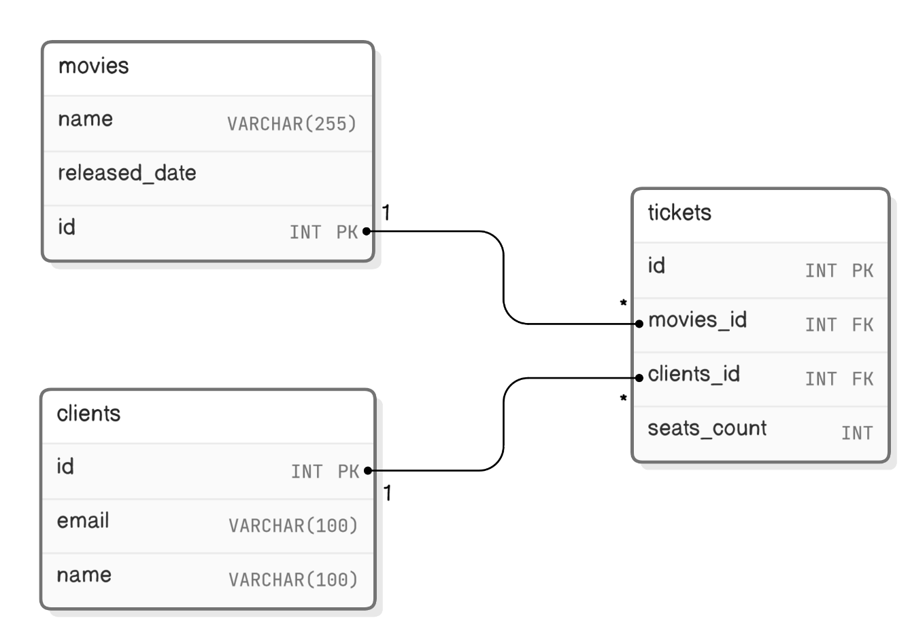
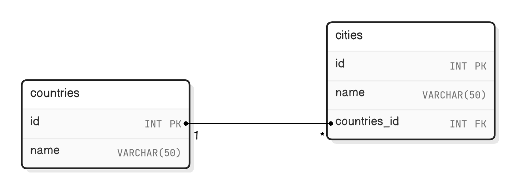
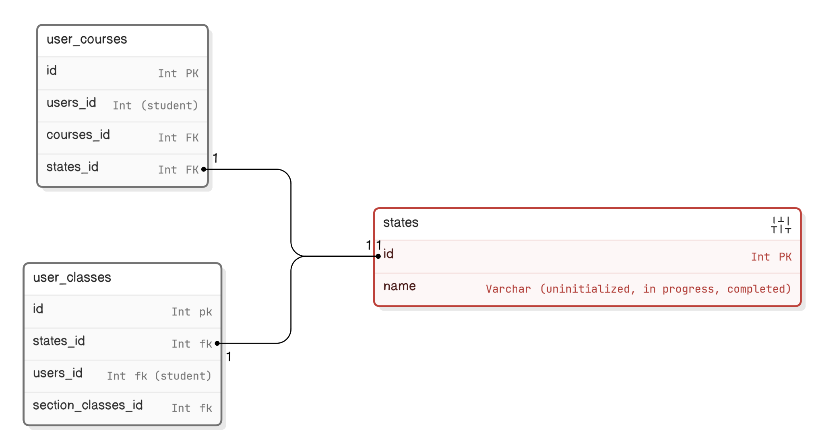

# Solution
## Many to Many Example

## One to Many Example

## One to One Example

- `user_courses` and `user_classes` tables are used to track user progress in a course.
- After a database normalization, we extracted the attribute `state` of both tables into its own table (`states`) and established a one-to-one relationship